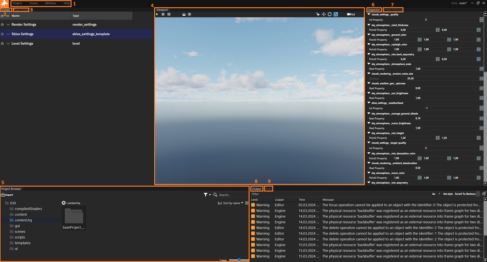

==================================
Знакомство с интерфейсом редактора
==================================

На этой странице описываются основные элементы и функции интерфейса **NAU ENGINE**.

Некоторые термины, встречаемые в тексте содержат ссылки на другие страницы, где вы можете получить дополнительную информацию.

При запуске проекта в **NAU ENGINE** открывается экранная форма:

.. image:: https://i.postimg.cc/LX6KSsF5/image1.jpg
   :alt: Интерфейс NAU ENGINE

.. raw:: html

    
    <table class="nau-table">
      <thead>
        <tr>
          <th><strong>Цифра</strong></th>
          <th><strong>Наименование</strong></th>
          <th><strong>Описание</strong></th>
        </tr>
      </thead>
      <tbody>
        <tr>
          <td><strong>1</strong></td>
          <td>Ленточное меню</td>
          <td>Меню для доступа к командам и функциям NAU ENGINE (сохранение, управление сценами, отображение окон и др.)</td>
        </tr>
        <tr>
          <td><strong>2</strong></td>
          <td>Сцена</td>
          <td>Совокупность динамических и статических объектов, их настроек и общих настроек игрового мира</td>
        </tr>
        <tr>
          <td><strong>3</strong></td>
          <td>Объекты</td>
          <td>На вкладке располагаются шаблоны различных объектов и источники освещения для добавления на сцену</td>
        </tr>
        <tr>
          <td><strong>4</strong></td>
          <td>Окно просмотра</td>
          <td>Отображает положение на сцене всех статических и динамических объектов</td>
        </tr>
        <tr>
          <td><strong>5</strong></td>
          <td>Браузер проекта</td>
          <td>Файловая система, в которой работает пользователь</td>
        </tr>
        <tr>
          <td><strong>6</strong></td>
          <td>Свойства объекта</td>
          <td>Вкладка с параметрами выделенного объекта или группы объектов</td>
        </tr>
        <tr>
          <td><strong>7</strong></td>
          <td>Настройка сцены</td>
          <td>Добавление или удаление скриптов для определения правил игровой логики, механики игровых уровней и др.</td>
        </tr>
        <tr>
          <td><strong>8</strong></td>
          <td>Ошибки</td>
          <td>Консоль для вывода различных служебных сообщений при работе в редакторе</td>
        </tr>
        <tr>
          <td><strong>9</strong></td>
          <td>Сборка</td>
          <td>Окно с фиксируемой информацией в логах при сборке проекта</td>
        </tr>
      </tbody>
    </table>

1. Ленточное меню
------------------
.. image:: https://i.postimg.cc/Hxz48RVh/1t.png

.. raw:: html

    
    <table class="nau-table">
      <thead>
        <tr>
          <th><strong>Наименование</strong></th>
          <th><strong>Обозначение</strong></th>
        </tr>
      </thead>
      <tbody>
        <tr>
          <td><strong>Проект</strong></td>
          <td></td>
        </tr>
        <tr>
          <td>Сохранить проект</td>
          <td>Сохранить изменения в проекте</td>
        </tr>
        <tr>
          <td>Показать в проводнике</td>
          <td>Посмотреть папки с файлами проекта на ПК пользователя</td>
        </tr>
        <tr>
          <td><strong>Сцена</strong></td>
          <td></td>
        </tr>
        <tr>
          <td>Новая сцена</td>
          <td>Создать новую сцену. Файл новой сцены располагается в папке /scenes</td>
        </tr>
        <tr>
          <td>Открыть сцену</td>
          <td>Открыть файл сцены. Выберете файл с расширением .nauscene в папке текущего проекта</td>
        </tr>
        <tr>
          <td>Сохранить сцену</td>
          <td>Сохранить текущие изменения на сцене</td>
        </tr>
        <tr>
          <td>Недавние сцены</td>
          <td>Отобразить список сцен, которые ранее были открыты</td>
        </tr>
        <tr>
          <td><strong>Окно</strong></td>
          <td>Нажатием левой кнопки мыши по строкам из выпадающего списка происходит отображение или скрытие выбранных окон</td>
        </tr>
        <tr>
          <td><strong>Справка</strong></td>
          <td>Окно с информацией о текущей версии Nau Editor</td>
        </tr>
      </tbody>
    </table>

2. Сцена (Scenes)
------------------

На вкладке **Сцена** перечислены все объекты, добавленные на сцену.

При нажатии левой кнопки мыши объект выделяется в **Окне просмотра** и в **Свойства объекта**. Можно выделять несколько объектов одновременно.

.. image:: https://i.postimg.cc/YCvRjmzW/2t.png

С объектами можно взаимодействовать нажатием правой кнопки мыши и выбором действия из выпадающего списка.

.. image:: https://i.postimg.cc/26mjK8CV/2-1t.png

3. Объекты (Place Entity)
------------------

На вкладке **Объекты** располагаются шаблоны различных объектов и источники освещения для добавления на сцену с заданными значениями данных

Шаблоны хранятся в текстовом формате **.entities.blk** в папке **/templates**, находящейся в корне проекта.

.. image:: https://i.postimg.cc/vZWpS7Tt/3t.png

Источник освещения **Точечный свет**  работает по принципу работы электрической лампочки, распространяя свет во всех направлениях. Для экономии ресурсов, процесс упрощен до освещения во всех направлениях только из одной точки пространства.

Источник освещения **Направляемый свет** распространяет свет из одной точки в форме конуса. В пределах конуса внутреннего угла свет достигает полной яркости. При перемещении за пределы внутреннего радиуса освещение ослабевает, создавая полутень или смягчение освещения вокруг светового пятна.

4. Окно просмотра (Viewport)
------------------

**Окно просмотра** отображает положение на сцене всех статических и динамических объектов, добавленные в проект.

В окне просмотра располагаются кнопки запуска, остановки и паузы проекта на сцене в режиме симуляции.

.. image:: https://i.postimg.cc/QxpFSPQ4/4t.png

.. raw:: html

    
    <table class="nau-table">
      <thead>
        <tr>
          <th><strong>Цифра</strong></th>
          <th><strong>Наименование</strong></th>
          <th><strong>Обозначение</strong></th>
        </tr>
      </thead>
      <tbody>
        <tr>
          <td>1</td>
          <td>Запустите эту сцену в режиме воспроизведения</td>
          <td>Кнопка запуска режима симуляции (Play mode) на сцене. При запуске проекта на сцене исчезнет курсор. Нажмите `Shift+F1`, чтобы он появился</td>
        </tr>
        <tr>
          <td>2</td>
          <td>Остановить режим воспроизведения</td>
          <td>Кнопка остановки позволит выйти из режима симуляции и вернуться к редактированию проекта в редакторе</td>
        </tr>
        <tr>
          <td>3</td>
          <td>Пауза режима воспроизведения</td>
          <td>Кнопка паузы временно поставит симуляцию на паузу, приостановив все процессы в игре</td>
        </tr>
        <tr>
          <td>4</td>
          <td>Открыть настройки сборки</td>
          <td>В открывшемся окне выбрать директорию для сборки проекта и действие после завершения сборки (никаких действий, открытие папки сборки, запуск сборки). Нажать кнопку <strong>ОК</strong> для старта сборки. Весь процесс сборки проекта отображается на вкладке Сборка. После окончания сборки проекта готовый файл запуска игры в папке в указанной ранее директории. Для запуска игры выбрать файл <code>start_win64.bat</code></td>
        </tr>
        <tr>
          <td>5</td>
          <td>Остановить сборку</td>
          <td>Кнопка остановки формирования сборки проекта</td>
        </tr>
      </tbody>
    </table>

А так же инструменты для работы с объектами на сцене:

.. image:: https://i.postimg.cc/9X7hKVgP/4-2t.png

.. raw:: html

    
    <table class="simple-table">
      <thead>
        <tr>
          <th>Цифра</th>
          <th>Наименование</th>
        </tr>
      </thead>
      <tbody>
        <tr>
          <td>1</td>
          <td>Выбрать объекты</td>
        </tr>
        <tr>
          <td>2</td>
          <td>Выбрать и переместить объекты</td>
        </tr>
        <tr>
          <td>3</td>
          <td>Выбрать и повернуть объекты</td>
        </tr>
        <tr>
          <td>4</td>
          <td>Выбрать и масштабировать объекты</td>
        </tr>
        <tr>
          <td>5</td>
          <td>Значение отображения скорости воспроизведения игрового проекта</td>
        </tr>
      </tbody>
    </table>

При работе со сценой можно использовать клавиши клавиатуры **WASD** для перемещения по сцене c зажатой правой кнопкой мыши и клавишу **F** для фиксации камеры на объекте.

5. Браузер проекта (Project Browser)
------------------

Окно проводника, в котором отображаются все ресурсы, шаблоны и другие файлы, содержащиеся в вашем проекте.

.. image:: https://i.postimg.cc/x19L3V45/5T.png
   :alt: Project Browser

Нажав кнопку **Импорт объекта в текущую папку** открывается окно проводника, в котором можно выбрать нужные файлы и добавить их в проект.

Поддерживаемые форматы: fbx, obj, glTF, glb, stl, nmat. Поддерживаемые форматы текстур: jpg, tga.

С файлами и папками можно взаимодействовать нажатием правой кнопки мыши и выбором действия из выпадающего списка.

.. image:: https://i.postimg.cc/zGh4KW4K/5-1T.png
   :alt: Дополнительное меню браузера

6. Свойства объекта (Inspector)
------------------

Cовокупность настроек параметров выделенных динамических и статических объектов игрового мира в окне просмотра или на вкладке **Сцена**.

.. image:: https://i.postimg.cc/qvH1fFZ6/6T.png
   :alt: Inspector

.. raw:: html

    
    <table class="animation-table">
      <thead>
        <tr>
          <th><strong>Наименование</strong></th>
          <th><strong>Обозначение</strong></th>
        </tr>
      </thead>
      <tbody>
        <tr>
          <td>Позиция</td>
          <td>Набор из трёх анимационных кривых для каждой оси (X, Y, Z)</td>
        </tr>
        <tr>
          <td>Вращение</td>
          <td>Набор из четырёх анимационных кривых характеризующих вращение выраженное кватернионом (X, Y, Z, W)</td>
        </tr>
        <tr>
          <td>Масштаб</td>
          <td>Набор из трёх анимационных кривых для каждой оси (X, Y, Z)</td>
        </tr>
      </tbody>
    </table>

7. Настройка сцены (Scene Settings)
------------------

Окно добавления скриптов на сцену для определении правил игровой логики, механики игровых уровней и др. 

.. image:: https://i.postimg.cc/t4PCJs5m/7T.png
   :alt: Scene Settings

Все скрипты в проекте располагаются в папке **/scripts** в корне проекта.

Скрипты реализованы на языке **DaScript** и разбиты логически по файлам *.das.

Для редактирования скриптов рекомендуется использовать **Visual Studio Code** c расширением **daScript**.

Для добавления скрипта необходимо нажать на кнопку **+** и в папке **/scripts** выбрать файл в формате .das.

Для удаления скрипта нажать кнопку **-**.

8. Ошибки (Output)
------------------

Консоль для вывода различных служебных сообщений при работе в **NAU ENGINE**.

.. image:: https://i.postimg.cc/mktTskkj/8T.png
   :alt: Output

9. Сборка (Build)
------------------

Окно с фиксируемой информацией в логах при сборке проекта.

.. image:: https://i.postimg.cc/Bbk4Q310/9T.png
   :alt: Build

